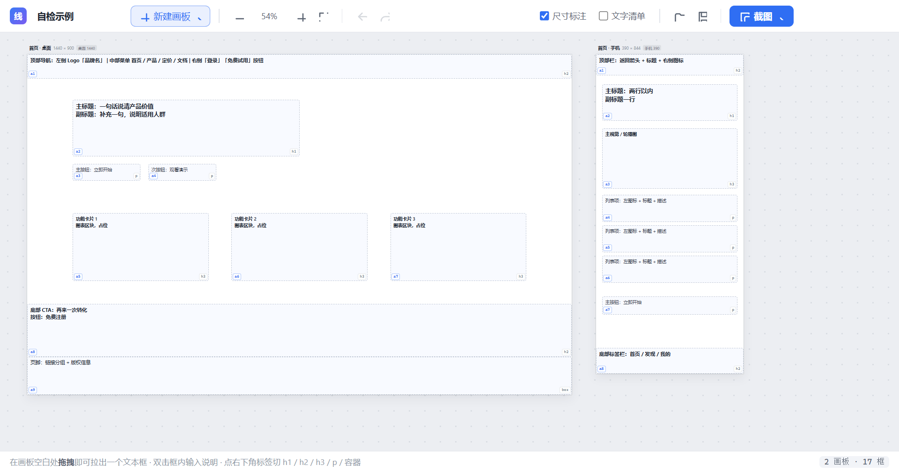
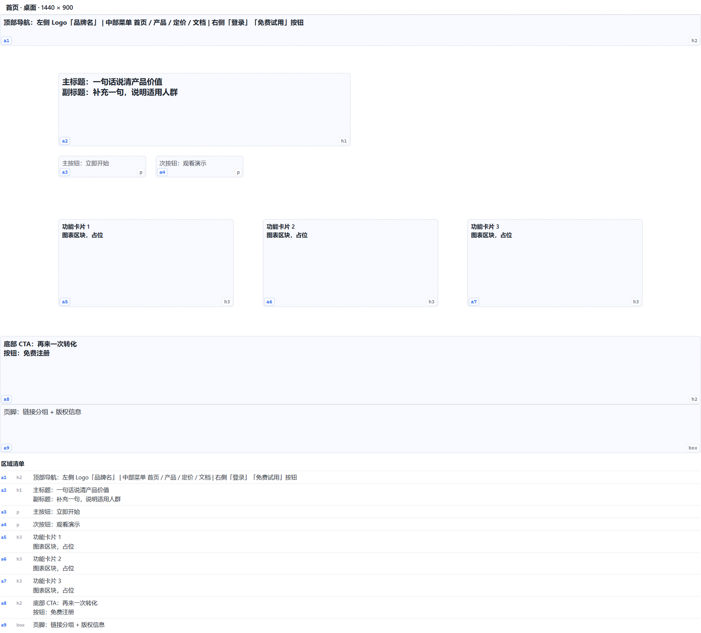
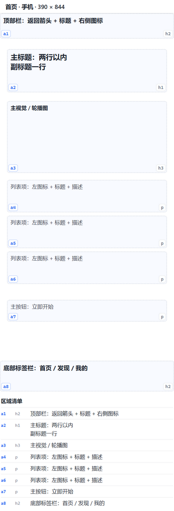

# 线框画布 · Wireframe Canvas

给前端/AI 协作做的**桌面端多端线框标注工具**。

一块白色画布，画布尺寸**就是真实设备视口尺寸**（手机 390×844 / 平板 768×1024 / 桌面 1440×900 …）。
在上面拖出一堆文本框，写下"这一块要放什么"，点一下截图 —— 图片进剪贴板，直接 Ctrl+V 丢给大模型。

**不做 JSON。** 版面结构和语义都写在图里了，大模型看图就懂。



左边是画板列表，右边是当前画板。框的**左下角是编号**（`a1`/`a2`…），**右下角是层级**（`h1`/`h2`/`p`…）——
这两个标记会一起截进图里，这就是"把语义写进图"的落点。

<table>
<tr>
<td width="50%">

**桌面端导出**（1440 × 900）



</td>
<td width="50%">

**手机端导出**（390 × 844）



</td>
</tr>
</table>

---

## 快速开始

### 方式一：部署到桌面（推荐，当前已就绪）

桌面上已经有「**线框画布**」快捷方式了，**双击即用**。开始菜单里也有一个。

它指向的程序装在：

```
%LOCALAPPDATA%\Programs\线框画布\线框画布.exe
```

重新构建后想同步更新桌面版，执行一次：

```bash
npm run dist:dir   # 先出最新产物
npm run deploy     # 再镜像部署 + 刷新快捷方式
```

不写注册表、不要管理员权限。**卸载 = 删掉那个目录 + 两个快捷方式**。

> 快捷方式**故意不指向 `dist/win-unpacked/`**：运行中的 exe 会锁住所在目录，
> 那样每次用完这个应用，下一轮构建就会卡死。所以先镜像部署到用户目录再建快捷方式。

### 方式二：安装版

```
dist/线框画布 Setup 1.0.0.exe
```

双击安装，可选安装路径，装完自动创建桌面和开始菜单快捷方式。
想要「控制面板里能卸载」的正式安装，用这个。

### 方式三：免安装绿色版

```
dist/win-unpacked/线框画布.exe      文件夹版，整个目录拷走即可
dist/线框画布 1.0.0.exe             单文件版（npm run dist:portable 生成）
```

### 方式四：从源码运行

```bash
npm install
npm start
```

Windows 上也可以直接双击项目根目录的 `run.cmd`。

### 方式五：浏览器里先试一下界面

直接打开 `src/index.html` 即可。界面、拉框、写文字、缩放全部可用；
只有「截图」和「保存 / 打开工程」需要桌面客户端（浏览器里会提示）。

---

## 怎么用

**1. 建画板** —— 点工具栏「新建画板」，选设备尺寸。
画板尺寸 = 该设备的真实视口宽度，所以你在 390 宽的画板上画的东西，
大模型拿到的那张图就是 390 px 宽的手机版式规格。

**2. 拉框** —— 在画板空白处**拖拽**出一个文本框（也可双击空白处快速生成一个）。
双击框内输入文字，说明这个区域要放什么，支持多行。

**3. 标层级** —— 每个框**右下角有个小标签**，点一下循环切换：

| 标签 | 含义 | 渲染效果 |
|------|------|----------|
| `h1` | 一级标题 | 16px / 加粗 |
| `h2` | 二级标题 | 13.5px / 加粗 |
| `h3` | 三级标题 | 12px / 半粗 |
| `p`  | 正文 | 12px / 常规 |
| `box`| 容器 / 其他 | 12px / 灰色 |

这个标签**会一起截进图里**，所以大模型看到的不只是一堆方块，
而是"这块是页面主标题、那块是正文"的语义结构 —— 这正是替代 JSON 的关键。

**4. 框编号** —— 每个框**左下角**有一个自动编号：`a1`、`a2`、`a3` …
按画板内的顺序排，删掉中间某个会自动重排，**永远是连续的、没有断号**。

- 每个画板各自从 `a1` 开始 —— 同一块区域在桌面端和手机端都叫 `a1`，方便两边对着说
- 编号也**会截进图里**，底部「文字清单」里同样带着
- 于是截图发给大模型后，你可以直接说「**a3 改成两栏**」「**把 a1 的导航做吸顶**」，
  指位不含糊，不用再费劲描述"左上角那个框"

> 编号由创建顺序决定，改不了也不用改 —— 你只管说 `a几`，它永远对应你说的那个框。
> 想交换编号，把框删掉重拉即可。

**5. 截图** —— 点右上角「截图」，图片直接进剪贴板，去任意对话窗口 Ctrl+V。

---

## 截图的两个开关

| 开关 | 作用 |
|------|------|
| **尺寸标注**（默认开） | 图片顶部加一条规格条：`首页 · 手机 · 390 × 844`。大模型看图就知道这是哪一端、多宽 |
| **文字清单**（默认关） | 图片底部附上所有框的编号 + 层级 + 原文（`a1 h2 顶部导航：左侧 Logo…`）。彻底免掉大模型 OCR 认错字的风险 |

截图菜单里还有「复制全部画板」—— 把所有画板横向拼成一张图，
一次说清同一个页面在桌面 / 平板 / 手机上的不同排布。

> 截图走的是**离屏 1:1 渲染**：另开一个尺寸和画板完全一致的隐藏窗口渲染，
> 再按设备像素截图。所以**无论你当前缩放多少、窗口多大，导出的图都是精确的设备尺寸**
> （390×844 就是 390×844），不会因为缩小看全图而糊掉。

---

## 快捷键

| 快捷键 | 作用 |
|--------|------|
| `Ctrl+Shift+C` | 复制当前画板截图到剪贴板 |
| `Ctrl+Shift+A` | 复制全部画板（拼接成一张） |
| `Ctrl+1` … `Ctrl+5` | 选中的框设为 h1 / h2 / h3 / p / box |
| `Ctrl+Z` / `Ctrl+Shift+Z` | 撤销 / 重做 |
| `Ctrl+D` | 复制选中的框 |
| `Delete` / `Backspace` | 删除选中的框 |
| `↑↓←→` | 微调位置（按住 `Shift` 每次 10px） |
| `Ctrl+滚轮` | 以光标为中心缩放 |
| `Ctrl+0` | 适应窗口 |
| `Ctrl+=` / `Ctrl+-` | 放大 / 缩小 |
| `空格 + 拖拽` | 平移画布 |
| `Alt + 拖拽` | 临时关闭边缘对齐吸附 |
| `Ctrl+S` / `Ctrl+O` | 保存 / 打开工程 |
| 双击框 | 进入文字编辑；`Esc` 退出 |

其它：拖动框时靠到别的框或画板边缘会自动吸附并显示粉色对齐线；
点画板标题可以重命名、换设备尺寸、复制、清空、删除。

---

## 几个设计取舍

- **固定画板，不是无限画布。** 你要的是"匹配多端"，那画板就必须有确定尺寸，
  否则截图出来大模型不知道这是手机还是桌面。
- **框就是文本框。** 没有图层树、没有组件库。你要表达的只有两件事：
  位置范围 + 这块是什么。多余的抽象都是拖慢速度的东西。
- **语义写在图里，不写在外面的 JSON。** 右下角的 `h1/h2/p` 层级标签、左下角的 `a1/a2` 编号、
  顶部的尺寸条，都是给大模型看的。一份截图就是一个完整的需求描述，
  而且后续对话里可以用 `a3`、`a7` 这种编号精确指位。
- **零运行时依赖。** 主进程、渲染进程全部只用 Electron 原生能力，
  没有引入任何前端框架或第三方库。

---

## 工程结构

```
wireframe-canvas/
├─ main.js                 主进程：窗口、离屏截图、剪贴板、文件对话框
├─ preload.js              contextBridge 安全桥
├─ src/
│  ├─ index.html           两种模式共用一个页面（app / export）
│  ├─ style.css            全部样式
│  └─ app.js               画板模型、拖拽/缩放/吸附、层级、导出渲染
├─ build/
│  └─ app.ico              应用图标（多尺寸内嵌 PNG）
├─ tools/
│  ├─ makeicon.js          用 Electron Canvas 生成 app.ico
│  ├─ clean.js             可靠删除构建产物（robocopy /MIR）
│  ├─ deploy.js            部署到 %LOCALAPPDATA% 并创建桌面/开始菜单快捷方式
│  ├─ package.js           便携版打包（纯 node 实现，不依赖 electron-builder）
│  ├─ smoketest.js         打包产物冒烟测试：从副本启动 exe，确认主进程稳定
│  └─ selftest.js          开发自检：跑一遍真实导出管线并存图核对
├─ docs/                   界面与导出效果预览图
└─ dist/                   安装包 / 免安装版输出目录（已 gitignore，本地生成）
```

数据默认自动存在浏览器 localStorage，另外可以 `Ctrl+S` 存成 `*.wire.json` 工程文件。

## 常用命令

```bash
npm start          # 源码运行
npm run icon       # 重新生成图标
npm run selftest   # 跑自检，导出示例画板到 WFC_OUT
npm run clean      # 清理 dist/ 与 dist-portable/
npm run dist:dir   # 【最快】只出免安装目录版 → dist/win-unpacked/   （约 20-40 秒）
npm run dist       # 完整安装包 → dist/线框画布 Setup 1.0.0.exe     （约 2-4 分钟）
npm run dist:portable   # 额外再出一个单文件免安装版
npm run deploy     # 部署到 %LOCALAPPDATA%\Programs\线框画布 并刷新桌面/开始菜单快捷方式
npm run smoke      # 冒烟测试：把 dist/win-unpacked 复制到临时目录并启动，确认能跑
```

---

## 关于构建耗时

构建**全部在本机完成**，不依赖任何云服务。慢的只有两个环节：

| 环节 | 说明 | 优化后 |
|------|------|--------|
| 铺 Electron 运行时 | 每轮都要复制 320MB 的文件 | 已裁剪语言包，73 → 19 个文件 |
| 7z LZMA 压缩 | NSIS 安装包要单线程压缩 320MB → 100MB | 已去掉重复的 `portable` target，只压一遍 |
| 原生依赖 rebuild | 本项目没有原生模块 | 已设 `npmRebuild: false` 直接跳过 |
| Windows Defender | 实时防护会扫描每一个落地的文件 | 非管理员改不了；可手动把项目目录加进排除项 |

**日常改代码只要 `npm run dist:dir`**，几十秒就能拿到可运行的客户端；
只有要发安装包时才跑 `npm run dist`。

> ⚠️ 不要从 `dist/win-unpacked/` 里直接双击运行 .exe 之后立刻重新构建 ——
> 运行中的 exe 会锁住该目录，导致下一轮构建卡死。
> 要试运行请先把 `win-unpacked` 整个复制到别处再双击。

### 构建卡死了怎么办

如果构建长时间停在某一步不动（CPU 占用为 0），多半是上一轮的产物被锁住了：

```bash
npm run clean     # 用 robocopy /MIR 强删 dist/
npm run dist
```

`tools/clean.js` 特意用 `robocopy /MIR` 而不是 `fs.rmSync` ——
在 Windows + 中文用户名路径下，`fs.rmSync` 删 300MB+ 目录时会静默挂死。

---

## 许可

[MIT](LICENSE) © 2026 buyunaihe666

仓库里**不含**构建产物（`dist/` 有 400MB+，已 gitignore）。
想直接拿可执行的客户端，请从 [Releases](../../releases) 下载，或按上面的步骤本地构建。

